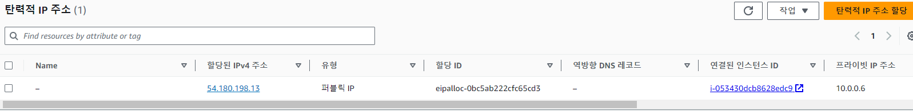
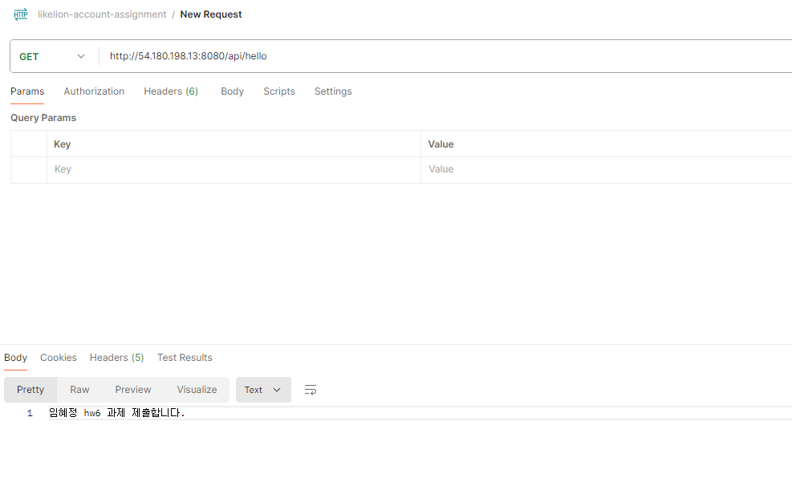

a. 배포 과정, 어려움을 정리한 개인 노션 링크 (해당 노션 페이지를 publish 하거나 멘토의 이메일을 추가하여 멘토가 해당 내용들을 확인할 수 있도록 해야함)  
https://www.notion.so/6-d162ec0059a64e5d84a1f0e904f56770?pvs=4

b. AWS 인스턴스에 할당된 탄력적 IP 스크린샷 (AWS에서 스크린샷) 

c. postman으로 GET http://ip주소:8080/api/hello 으로 요청을 보냈을 때 본인이름 hw6 과제 제출합니다. 라는 응답이 오는 스크린샷 (이를 위해 프로젝트에서 api/hello 경로에 대한 요청을 처리하는 메소드가 필요) 

